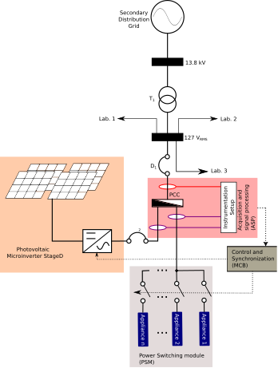

# DG-NILM - A high-frequency dataset for non-intrusive load monitoring and PV-inverter BTM identification

DG-NILM-V1 is a dataset for NILM and BTM identification composed of electrical variables time-windows samples in a real-world distribution system with both electrical appliances and photovoltaic generation. Dataset version V1 measurements were obtained between December 2022 and February 2023, at POLITEC facilities, at the Federal University of Technology (UTFPR), in Pato Branco, Paraná, Brazil. Figure 1 shows the single-line diagram of our proposed experimental setup.

Figure 1 - Single-Line diagram of our experimental setup

## Dataset Construction

Each acquisition window (AW) has 16s of sampled variables at 1000kHz, totalizing 16000 samples per AW. We separated the entire dataset into two subsets: Aggregated (with overlapped appliances) and Individual (without overlapped appliances). For each AW, we annotated the state (turned on or turned off) of a PV inverter connected to the Point of Commum Connection (PCC).

### Parameters selection for data sampling

The main parameters for data sampling are:

- High sampling frequency $(f_{high}=1000Hz)$: Sampling frequency for each voltage or current measurement contained in an AW; 
- Low sampling frequency $(f_{low}=\frac{1}{60})$: Sampling frequency of the PV inverter registers, or the inverse of the period between two consecutive AWs $(\Delta t)^{-1}$ ;
- Acquisition window time interval (AWTI)}: This measure is given in seconds and represents the time interval corresponding to an AW;
- Number of samples per acquisition window $n_{aw}=16000$: Knowing the previous definitions, $n_{aw} = f_{high} \times \text{AWTI} $.

Figure 2 shows a set of typical waveforms for two consecutive AWs, highlighting the abovementioned parameters. Figure 2a shows in green two consecutive acquisition windows. In seconds, the duration of a particular acquisition window is $AWTI$. Two consecutive AW start=points are separated by an interval of $\Delta t = t_2=t_{ini}$ seconds. In Figure 2a, $AWTI = t_1 - t_{ini}=t_3-t_2$. We also show in figure 2a, in red, an example of the interval $t_{inv}-t_{ini}$ in which the PV inverter is turned on (generating energy). After the instant $t=t_{inv}$, the PV inverter is off (not generating energy). For our example case, in which we show two AW, we have the inverter on (*on* state) in the first AW (left green area) and off (*off* state) in the second AW (right green area ). 

Figure 2b shows an example of a set of switching patterns for four relays (switches a, b, c, and d), each controlling an individual appliance. Our hardware controls each switch with a predetermined switching interval. Note that the total time interval showed in Figure 2b is $AWTI$, being Figure 2b a zoomed version of Figure 2a. In figure 2b, we represent each of these switching intervals with different colors: pink for switch a, blue for switch b, yellow for switch c, and grey for switch d.  

Figure 2

Our hardware allows us to choose the instants at which each load is triggered within an AW. This flexibility allows us to assemble the load combinations we want. Some possible examples are:

- Sequential triggering of individual loads (TIL):} In this case, we choose a switching interval for each load so that only one load is activated at a time, without overlapping more than one load at the same time;
- Aggregate triggering with fixed intervals (TFI):} In this case, we choose fixed switching intervals and always starting at the same times for all switches, with overlapping loads;
- Aggregate triggering with a finite set of different intervals (TDI):} In this case, we choose a finite set of switching patterns for the relays, generating a finite set of different switching patterns for different AWs;
- Aggregate triggering with a random set of different intervals (TRI):} In this case, we choose a random switching pattern for each load, and there is an infinite set of possible combinations between these patterns, generating all AW with different switching patterns.

### Electrical appliances choosing

We choose four electrical loads of different natures to compose our dataset. We describe the loads chosen in the items below:

- We choose an electric iron with a nominal power of 900W. The electric iron is a predominantly linear (resistive) load, prevalent in most residential consumption units, and with relatively high power (above 500W);
- Single Phase Induction Motor: We chose a 0.5hp single-phase motor, with capacitor start. This type of load has a non-linear behavior caused by the magnetic characteristics of the iron and the air gap, resulting in a specific power signature. In Brazilian homes, it is common for this type of load to be used in washing machines that do not use frequency inverters;
- Driller + Transformer: We built an arrangement by connecting a driller Bosch 3601B185D0 with 127V nominal voltage to a single-phase 127V\/220V transformer. The drill has a universal motor (DC motor in series configuration). This arrangement, with a total nominal power of 700W, has a non-linear behavior caused both by the motor action and by the magnetic saturation and in-rush current of the transformer;
- Dimmer: Bearing in mind that more than 70\% of Brazilian homes have an electric shower, that an electric shower is a resistive load, and that the temperature control of these devices is usually carried out employing thyristor switching systems, we build an arrangement of resistive loads commanded by a dimmer. We control the average power delivered to the resistive array through the dimmer firing angle. This adjustment leads to a resistive behavior and adds considerable harmonic content to the residential network.

