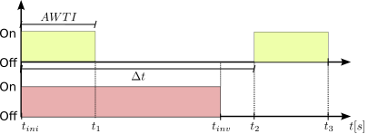
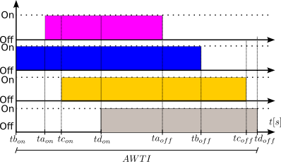

# DG-NILM - A high-frequency dataset for non-intrusive load monitoring and PV-inverter BTM identification

DG-NILM-V1 is a dataset for NILM and BTM identification composed of electrical variables time-windows samples in a real-world distribution system with both electrical appliances and photovoltaic generation. Dataset version V1 measurements were obtained between December 2022 and February 2023, at POLITEC facilities, at the Federal University of Technology (UTFPR), in Pato Branco, Paraná, Brazil. Figure 1 shows the single-line diagram of our proposed experimental setup.


Figure 1 - Single-Line diagram of our experimental setup

## Dataset Construction

Each acquisition window (AW) has 16s of sampled variables at 1000kHz, totalizing 16000 samples per AW. We separated the entire dataset into two subsets: Aggregated (with overlapped appliances) and Individual (without overlapped appliances). For each AW, we annotated the state (turned on or turned off) of a PV inverter connected to the Point of Commum Connection (PCC).

## Download Dataset

Click [](https://drive.google.com/drive/folders/1uDjzmx8DErOiJZqVZp4nAGHf40W8LSkb)  to access the download link of the entire RAW dataset and the pre-processed. 

The Dataset folder has two subfolders: "RAW" and "preprocessed_data". "RAW" contains the original data collected from the sensor boards (SB), with no scaling or any signal processing. "pre_processed_data", on the other hand, contains chunks of each original AW, taken every 1000 consecutive non-changed labels interval of a RAW acquisition window. 

### RAW data folder structure

RAW also has two subfolders: "with_DG" and "without_DG." The "with_DG" subfolder contains acquisition windows taken with the presence of Photovoltaic (PV) Distributed Generation (DG), and the "without_DG" contains acquisition windows only with aggregated loads, without PV DG. 

Below we detail the files for each of these cases:

- `./DG-NILM-V1/Dataset/RAW/aggregated/with_DG/`: Contains files with the standardized names `raw_agg_with_DG_n`, with `raw_agg` indicating that it is aggregated raw data, and `with_DG` indicating that this is the case *with* DG
- `./DG-NILM-V1/Dataset/RAW/aggregated/without_DG/`: Contains files with the standardized names `raw_agg_with_DG_n`, with `raw_agg` indicating that it is aggregated raw data, and `without_DG` indicating that this is the case *without* DG
- `./DG-NILM-V1/Dataset/RAW/individual/with_DG/`: Contains files with the standardized names `raw_agg_with_DG_n`, with `raw_ind` indicating that it is individual raw data, and `with_DG` indicating that this is the case *with* DG
- `./DG-NILM-V1/Dataset/RAW/individual/without_DG/`: Contains files with the standardized names `raw_agg_with_DG_n`, with `raw_ind` indicating that it is individual raw data, and `without_DG` indicating that this is the case *without* DG

Each RAW aggregated or individual subfolder file contains a matrix with `n_samples = 16000` lines and three columns:

* Each line is one acquisition sample;
* The first column is an integer number representing each appliance's status (on or off). One can get the binary label of each appliance by simply converting the integer value of the first column to binary;
* The second column contains the ADC value of the Aggregated Current (`I_agg`);
* The third column contains the ADC value of the Inverter Current (`I_inv`);
* One can obtain the Inverter Label by considering the condition pointed by the RAW subfolder name, `with_DG` or `without_DG`.


#### Detail of the labels applied to each electrical load

We choose four electrical loads of different natures to compose our dataset. We describe the loads chosen in the items below:

- We choose an **electric iron** with a nominal power of 900W. The electric iron is a predominantly linear (resistive) load, prevalent in most residential consumption units, and with relatively high power (above 500W);
- Single **Phase Induction Motor**: We chose a 0.5hp single-phase motor, with capacitor start. This type of load has a non-linear behavior caused by the magnetic characteristics of the iron and the air gap, resulting in a specific power signature. In Brazilian homes, it is common for this type of load to be used in washing machines that do not use frequency inverters;
- **Driller + Transformer**: We built an arrangement by connecting a driller Bosch 3601B185D0 with 127V nominal voltage to a single-phase 127V\/220V transformer. The drill has a universal motor (DC motor in series configuration). This arrangement, with a total nominal power of 700W, has a non-linear behavior caused both by the motor action and by the magnetic saturation and in-rush current of the transformer;
- **Dimmer**: Bearing in mind that more than 70\% Brazilian homes have an electric shower, that an electric shower is a resistive load, and that the temperature control of these devices is usually carried out employing thyristor switching systems, we build an arrangement of resistive loads commanded by a dimmer. We control the average power delivered to the resistive array through the dimmer firing angle. This adjustment leads to a resistive behavior and adds considerable harmonic content to the residential network.

In this readme file, we consider the following:

- `SW1`: labels for Electrical Iron;
- `SW2`: labels for Single Phase Induction Motor
- `SW3`: labels for Driller + Transformer
- `SW4`: labels for Dimmer


#### How to get binary labels from the first column of the RAW `.txt` file

We suggest converting the integer values from the first column of the RAW `.txt` following the code:

```
y_bin = ["{0:04b}".format(i) for i in labels_out]
y_bin = np.array(y_bin)

sw1 = np.zeros([y_bin.shape[0]])
sw2 = np.zeros([y_bin.shape[0]])
sw3 = np.zeros([y_bin.shape[0]])
sw4 = np.zeros([y_bin.shape[0]]) 

for k in range(y_bin.shape[0]):
    sw1[k] = y_bin[k][0]
    sw2[k] = y_bin[k][1]
    sw3[k] = y_bin[k][2]
    sw4[k] = y_bin[k][3]
```
where `labels_out` is a column array obtained from the first column of the RAW `.txt` file. 


### Pre-processed data folder structure

`./DG-NILM-V1/Dataset/pre_processed_data` folder contains four subfolders, each one corresponding to a specific subset of a DG presence status:

1. `./DG-NILM-V1/Dataset/pre_processed_data/aggregated_with_DG`: Case with loads overlapping and with DG generation.
2. `./DG-NILM-V1/Dataset/pre_processed_data/aggregated_without_DG`: Case with loads overlapping and without DG generation.
3. `./DG-NILM-V1/Dataset/pre_processed_data/individual_with_DG`: Case without loads overlapping and with DG generation.
4. `./DG-NILM-V1/Dataset/pre_processed_data/individual_without_DG`: Case without loads overlapping and without DG generation. 

Each of the folders `1-4` above contains two files: `i1_out_entire.hdf5` and `i2_out_entire.hdf5`. `i1_out_entire.hdf5` and `i2_out_entire.hdf5` contains chunks of 1000 continuous non-changed labels samples obtained from RAW data. We use [this code](./p1_pre_processing_all_folder.py)
  to pre-process the RAW data and obtain such chunks. `i1_out_entire.hdf5` contains the *aggregated* chunks, and `i2_out_entire.hdf5` contains the *inverter* chunks.

### Scale factor to convert RAW data to real-world values

RAW data values are at `0-10^12`, corresponding to the ADC's 12 bits resolution. To get real-world-ranged current variables, one must remove the offset (the half of `10^12`) and multiply the result by the *scaler* value.

- *Scaler* for `I_agg`: `k_agg = 0.036450093058151`
- *Scaler* for `I_inv`: `k_inv = 0.018739120738522`

### Parameters selection for data sampling

The main parameters for data sampling are:

- High sampling frequency $(f_{high}=1000Hz)$: Sampling frequency for each voltage or current measurement contained in an AW; 
- Low sampling frequency $(f_{low}=\frac{1}{60})$: Sampling frequency of the PV inverter registers, or the inverse of the period between two consecutive AWs $(\Delta t)^{-1}$ ;
- Acquisition window time interval (AWTI)}: This measure is given in seconds and represents the time interval corresponding to an AW;
- Number of samples per acquisition window $n_{aw}=16000$: Knowing the previous definitions, $n_{aw} = f_{high} \times \text{AWTI} $.

Figure 2 shows a set of typical waveforms for two consecutive AWs, highlighting the abovementioned parameters. 

Figure 2a shows in green two consecutive acquisition windows. In green, we show two acquisition windows whose start point is separated by a $\Delta t$ time interval. In red, we show an example of the state transition in PV inverter conditions, from on to off, if $t>t_{inv}$. In seconds, the duration of a particular acquisition window is $AWTI$. Two consecutive AW start=points are separated by an interval of $\Delta t = t_2=t_{ini}$ seconds. In Figure 2a, $AWTI = t_1 - t_{ini}=t_3-t_2$. We also show in Figure 2a, in red, an example of the interval $t_{inv}-t_{ini}$ in which the PV inverter is turned on (generating energy). After the instant $t=t_{inv}$, the PV inverter is off (not generating energy). For our example case, in which we show two AW, we have the inverter on (*on* state) in the first AW (left green area) and off (*off* state) in the second AW (right green area ). 

Figure 2b shows an example of a set of switching patterns for four relays (switches a, b, c, and d), each controlling an individual appliance. Our hardware controls each switch with a predetermined switching interval. Figure 2b details the switching patterns inside a particular acquisition window (interval AWTI). We show here four switch states waveforms, each with a different color. Let switch A be the pink waveform, switch B the blue, switch C the yellow, and switch D the grey. Note that the total time interval shown in Figure 2b is $AWTI$, being Figure 2b a zoomed version of Figure 2a. In Figure 2b, we represent each switching interval with different colors: pink for switch a, blue for switch b, yellow for switch c, and grey for switch d.  



Figure 2a - Typical Switching Times Among Acquisition Windows in DG-NILM


Figure 2b - Typical Switching Times Inside a Particular Acquisition Window in DG-NILM

Our hardware allows us to choose the instants at which each load is triggered within an AW. This flexibility allows us to assemble the load combinations we want. Some possible examples are:

- Sequential triggering of individual loads (TIL):} In this case, we choose a switching interval for each load so that only one load is activated at a time, without overlapping more than one load at the same time;
- Aggregate triggering with fixed intervals (TFI):} In this case, we choose fixed switching intervals and always start at the exact times for all switches with overlapping loads;
- Aggregate triggering with a finite set of different intervals (TDI):} In this case, we choose a finite set of switching patterns for the relays, generating a finite set of different switching patterns for different AWs;
- Aggregate triggering with a random set of different intervals (TRI):} In this case, we choose a random switching pattern for each load, and there is an infinite set of possible combinations between these patterns, generating all AW with different switching patterns.

## Experiments with DG-NILM dataset

This section concerns the results submitted as a paper to the Journal of Control, Automation and Electrical Systems, in October 2024. All scripts and implementation details are in the branch [Access JCAES2024 Branch](../JCAES2024/). This branch has folders ` [Methods](../JCAES2024/Methods) and [auxiliar_scripts](../JCAES2024/auxiliar_scripts).


We prepared three classification experiments with DG-NILM-V1: *Inverter Detection Experiment* (IDE), *Loads Detection Experiment* (LDE), and *Loads and Inverter Detection Experiment* (LIDE), with different frameworks. For LDE and LIDE, we use multi-label binary classification. For IDE, we use binary classification. The purpose of LDE is to disaggregate and classify the electrical loads aggregated in `I_agg` into scenarios *with* and *without* the DG presence. The purpose of LIDE is to disaggregate and classify both the electrical loads and the presence of the inverter in the aggregated *I_agg* signal. Finally, IDE aims to identify and classify the presence of distributed generation in the aggregate signal *I_agg*.

[Methods](../JCAES2024/Methods) folder contains the implementations of IDE, LIDE, and LDE considering four state-of-the-art approaches: Sequencer [1], InceptionTime [2], DeepDFML [3] and ST-NILM [4]. We use [TSAI](https://github.com/timeseriesAI/tsai) to implement Sequencer and Inception, [this repository](https://github.com/LucasNolasco/DeepDFML-NILM) to implement DeepDFML and [this repository](https://github.com/LucasNolasco/ST-NILM) to implement ST-NILM.

Before reproducing the experiments LDE, LIDE, and IDE, please follow these steps:

1. First, [download the branch](../JCAES2024/) and extract the content;
2. Download the segments [through the link](https://drive.google.com/drive/folders/11wv6WqpKKDCWrLOa3dBvuqClEdCyC2KZ?usp=sharing);
3. Place the segments folder into the JCAES2024 branch root folder;
4. Verify and adequate all the addresses pointing to the segments;
5. Install all the dependencies cited in [requirements.txt](../main/requirements.txt) file

